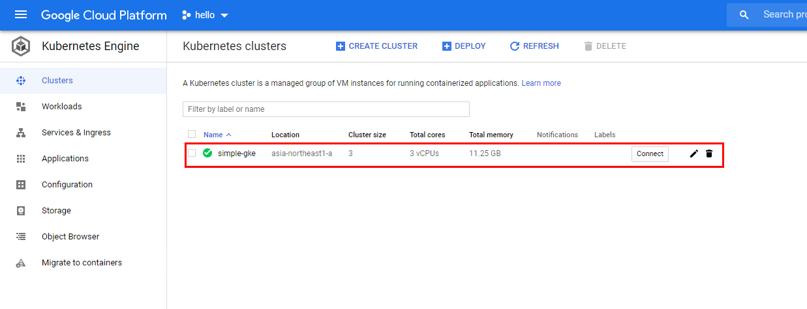
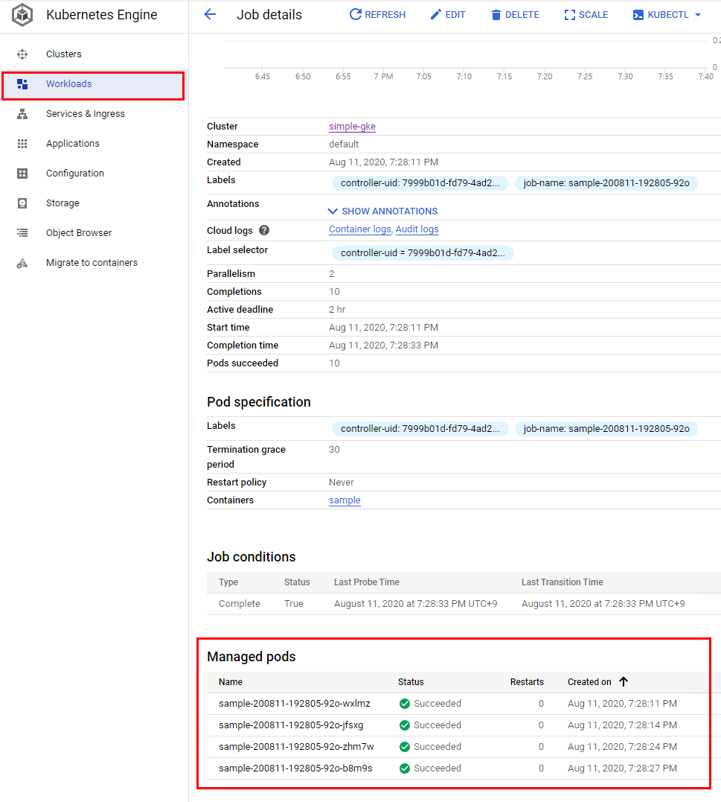
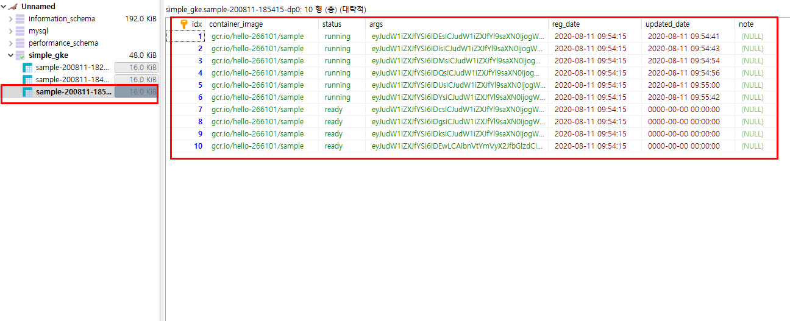

<p align="center">
  <a href="" rel="noopener">
 </a>
 <br>

 
</p>

<h3 align="center">Simple GKE</h3>

<div align="center">

[]()
[](https://github.com/da-huin/simple_gke/issues)
[](https://github.com/da-huin/simple_gke/pulls)
[](/LICENSE)

</div>

---

<p align="center"> 매우 큰 작업을 실행하는 서비스가 필요할 때 Lambda 와 Cloud Run 은 Timeout, Memory, CPU 등의 제한이 있어서 문제가 될 때가 있습니다. 이 문제를 해결하기 위해 만들어졌습니다.
    <br> 
</p>

## 📝 Table of Contents

- [About](#about)
- [Getting Started](#getting_started)
- [API](#api)
- [Acknowledgments](#acknowledgement)

## 🧐 About <a name = "about"></a>

Simple GKE 가 작동하는 방식은 아래와 같습니다.

1. Simple GKE 라는 서비스를 클라우드런에 실행시킵니다.

1. `작업을 관리하는 사용자의 코드`에서 Simple GKE 서비스에 클러스터를 켜달라고 요청합니다. (상시로 켜두어도 됩니다.)

1. 작업시킬 작업자 도커를 Google Container Registry 에 배포합니다.

1. `작업을 관리하는 사용자의 코드`에서 Simple GKE 서비스에 작업자 도커에 각자의 매개변수를 넣어 작업을 진행해달라고 요청합니다.

1. Simple GKE 는 RDB 에 작업별 매개변수를 저장하고 GKE 에 작업을 실행해달라고 말합니다.

1. 작업자 도커에서 Simple GKE 와 통신하며 작업 상황을 보고합니다.

1. 작업의 결과를 API 로 받아보거나 RDB Viewer 에서 직접 확인 할 수 있습니다.

1. 작업이 완료되면 GKE 는 자동으로 클러스터의 인스턴스들을 공격적으로 줄입니다.


아래의 API를 사용 할 수 있습니다.

* [create_cluster](#create_cluster)
* [delete_cluster](#delete_cluster)
* [action](#action)
* [fetch](#fetch)
* [report](#report)
* [status](#status)
* [get_log](#get_log)
* [clear_log](#clear_log)
* [kill](#kill)

### 주의할점

1. GKE 는 클러스터를 확장하는 속도 등이 느리기 때문에 Lambda 와 Cloud Run 으로 할 수 없는 큰 작업에서 사용하는 것이 효율적입니다.

## 🏁 Getting Started <a name = "getting_started"></a>

<a name="prerequisites"></a>

### Prerequisites

1. GKE 가 사용 설정되지 않았다면 아래의 링크에서 GKE 를 사용 설정하세요.

    https://console.cloud.google.com/kubernetes


### 🚀 Tutorial

#### 1. 배포 할 작업자 도커 확인하기

1. Sample 작업자 폴더를 아래의 경로에서 확인합니다.

     `SIMPLE_GKE_DIRECTORY/sample`

1. `SIMPLE_GKE_DIRECTORY/sample/src/app.py` 폴더를 편집기로 열어서 어떤 식으로 구성되어있는지 확인합니다.
    
    * **다른 언어로 만들어진 작업자 도커를 만들 땐 아래와 같이 하면 됩니다.**

        1. 작업자 도커 폴더를 생성합니다.

        1. Worker 클래스를 다른 언어로 구현합니다.

            * 요청만 보낼 수 있으면 어떤 언어로도 구현 할 수 있습니다.

    * app.py 코드는 다음과 같습니다.

    ```python
    from pprint import pprint
    import sys
    import os
    import requests

    # === 여기 (work 함수) 에만 작업하면 됩니다 ===

    def work(args):
        # 구구단을 처리 할 수 있는 샘플 작업입니다.
        number_a = args["number_a"]
        number_b_list = args["number_b_list"]
        
        note = [number_a * number_b for number_b in number_b_list]
        return note

    # === 여기부터는 무시해도 됩니다 ===


    class Worker():

        def __init__(self):
            fetched_data = self.fetch()
            self.worker_index = fetched_data["idx"]
            self.args = fetched_data.get("args", {})
            self.master_uri = os.environ["MASTER_URI"]
            self.table_name = os.environ["TABLE_NAME"]

        # 매개변수를 Simple GKE 에서 가져옵니다.
        def fetch(self):
            response = requests.post(f"{self.master_uri}/fetch", json={"table_name": self.table_name})

            assert response.status_code == 200

            return response.json()


        # 결과를 Simple GKE 에 보고합니다.
        def report(self, success, note=""):
            response = requests.post(f"{self.master_uri}/report", json={
                "table_name": self.table_name,
                "idx": self.worker_index,
                "success": success,
                "note": note
            })

            assert response.status_code == 200
            
            return response.json()

        def start(self):
            note = ""
            try:
                note = work(self.args)
            except Exception as e:
                self.report(False, str(e))
                raise Exception(e)
            else:
                self.report(True, str(note))

            return note


    Worker().start()

    ```

#### 2. Cloud Run 에 작업자 도커와 Simple GKE 배포하기

Cloud Run 에 어떤 방식으로든 배포 할 수 있으면 됩니다. 여기에서는 [easy_cloudrun](https://github.com/da-huin/easy_cloudrun) 을 사용한 방식으로 배포해보겠습니다.

*  (선택) RDB 가 없다면 아래의 명령어로 RDB 를 실행시킵니다.

    ```bash
    docker run --rm --name some-mariadb -e MYSQL_ROOT_PASSWORD=1234 -p 3306:3306 mariadb && docker logs -f some-mariadb
    ```

아래의 코드로 Cloud Run 에 배포합니다.


```python
import easy_cloudrun

handler = easy_cloudrun.EasyCloudRun()

dockerfile_dir = "YOUR_SIMPLE_GKE_DIRECTORY" # 이 깃의 폴더 경로입니다.
environ = {}

environ = {
    "SELF_URI": "URL of Simple GKE to be deployed in CloudRun", # Example: https://simple-gke-xxxxxxxx-an.a.run.app
    "DB_HOSTNAME": "YOUR_DB_HOSTNAME",
    "DB_USER": "YOUR_DB_USER",
    "DB_PASSWORD": "YOUR_DB_PASSWORD",
    "GCLOUD_SERVICE_ACCOUNT": "YOUR_GCLOUD_SERVICE_ACCOUNT", # Example: PROJECT_NAME@appspot.gserviceaccount.com
    "GCLOUD_PROJECT_NAME": "YOUR_GCLOUD_PROJECT_NAME",
}

commands = {
    "--allow-unauthenticated": ""
}

handler.run("simple-gke", dockerfile_dir, environ=environ)


handler.build_push_deploy("simple-gke", dockerfile_dir,
                          environ=environ, commands=commands)

dockerfile_dir = "SIMPLE_GKE_DIRECTORY/sample" 

handler.build_push("sample", dockerfile_dir)
```

#### 3. Simple GKE 가 잘 올라갔나 확인해보기

```python
>>> import requests
>>> master_url = "YOUR_SIMPLE_GKE_URL"
>>> requests.post(master_url).text
{"message":"hello world!"}
```

#### 4. 만든 작업을 테스트해보기

1. GKE 클러스터가 실행되고 있지 않다면 Simple GKE API 에 요청하여 클러스터를 실행합니다.
    
    ```python
    import requests
    url = "URL_of_Simple_GKE_to_be_deployed_in_CloudRun/create_cluster"

    data = {
        "machine_type": "n1-standard-1",
        "disk_size": 35,
        "num_nodes": 3
    }

    requests.post(url, json=data).text
    ```

    

1. 아래의 경로에서 클러스터가 켜질 때까지 기다려야 합니다. 새로 키려면 오래 걸립니다.

    https://console.cloud.google.com/kubernetes


1. 테스트를 위해 아래의 테스트 코드를 실행해봅니다.

    ```python

    import requests

    project_name = "YOUR_GCP_PROJECT_NAME"
    service_name = "sample"
    master_url = "YOUR_SIMPLE_GKE_URL"
    # 여기에서 요청 할 매개변수를 작성하면 됩니다.
    each_args = []

    for i in range(10):
        args = {}
        args["number_a"] = i + 1
        args["number_b_list"] = [j for j in range(100)]
        each_args.append(args)

    data = {
        "each_args": each_args,
        "environ": {"hello": "world"}, # 환경변수입니다.
        "container_image": f"gcr.io/{project_name}/{service_name}", # 실행 할 작업 도커 이미지입니다.
        "parallel_action_count": 5, # 하나의 인스턴스가 몇개의 작업을 실행 할 지 정합니다.
        # "action_name": "your_action_name", # 이 값을 생략하면 도커 이미지 이름으로 자동 배정됩니다.
        # "active_dead_line_seconds": 3600, # 이 작업의 시간제한을 정합니다.
        # "public_command": [], # 만약 Dockerfile 에서 CMD 명령으로 어떤 작업을 실행한다면 이 명령어는 사용하지 않아도 됩니다. 모든 작업에 배정될 명령어입니다.
        # "public_args": [], # 위 명령어에 붙을 인자들입니다.
        # cpu_limit = 4, # 작업에 사용할 CPU 제한입니다.
        # memory_limit = 1024Mi, # 작업에 사용할 메모리 제한입니다.
        # cpu_request = 1, # 작업에 사용할 CPU 요청입니다.
        # memory_request = 128Mi, # 작업에 사용할 메모리 요청입니다.
    }

    response = requests.post(f"{master_url}/action", json=data)

    print(response.status_code)

    print(response.json()["message"])

    ```

    실행결과: 
    
    * 아래의 값은 RDB 에 저장되는 Table 이름이면서 ID 입니다.
    * 상태를 확인하는 등의 함수에 사용됩니다.

    ```bash
    200
    sample-200811-184627-klu
    ```

1. GKE 콘솔에서 확인해봅니다.

    

1. 아래의 코드로 작업 상태를 확인해봅니다.

    ```python
    import requests

    url = "[CLOUD RUN 에 실행되고 있는 JOBBER 의 주소]/status"
    data = {
        "table_name": "작업 실행 할 때 requests.post('/action') 결과값으로 받은 작업 Table ID"
    }

    requests.post(url, json=data).json()["message"]
    ```

    실행결과
    ```bash
    {'ready': 4, 'running': 6}
    ```

1. RDB 뷰어 툴로 직접 작업 상태를 확인해봅니다.

    


#### 4. (선택) 만든 클러스터를 종료하기

```python
>>> requests.post(f"{master_url}/delete_cluster").text
{"message":"your request has been completed. please check the cloud run log"}
```

## 🎈 API <a name="api"></a>

작업 도커에게 아래 두개의 특별한 환경변수가 입력되어 있습니다.

* `MASTER_URI`
    
    Cloud Run 에 올라가있는 `Simple GKE` URI 입니다.

* `TABLE_NAME`

    작업 전용 테이블의 이름이며 ID 입니다.

### 🌱 /create_cluster <a name="create_cluster"></a>

    클러스터를 생성 할 때 사용합니다.

**Parameters**

* `machine_type`: str (default = "n1-standard-1")

    노드에 실행 된 머신 타입입니다.
    
* `disk_size`: str (default = "100")

* `num_nodes`: str (default = "5")

    노드의 최소 실행 갯수입니다.

**Returns**

* `요청이 전송되었다는 메시지`: str

### 🌱 /delete_cluster <a name="delete_cluster"></a>

    클러스터를 중지 할 때 사용합니다.

**Parameters**

* 매개변수가 없습니다.

**Returns**

* `요청이 전송되었다는 메시지`: str

### 🌱 action <a name="action"></a>

**Parameters**

* `each_args`: list

    작업자 도커에게 전달할 각자의 매개변수입니다.

* `environ`: dict

    작업자 도커가 공통으로 사용할 환경변수입니다.

* `container_image`: str

    작업자 도커 이미지 경로입니다. 아래에 예시가 있습니다.

    ```
    gcr.io/{project_name}/{service_name}
    ```

* `action_name`: str

    작업 이름입니다. 이 값을 생략하면 기본 도커 이미지 이름으로 배정됩니다.

* `parallel_action_count`: int

    하나의 인스턴스가 몇개의 작업을 실행 할 지 정합니다.

* `active_dead_line_seconds`: int

    이 작업의 시간제한을 정합니다.

* `public_command`: list

    만약 Dockerfile 에서 CMD 명령으로 어떤 작업을 실행한다면 이 명령어는 사용하지 않아도 됩니다. 모든 작업에 배정될 명령어입니다.

* `public_args`: list

    매개변수 `public_command`의 인자들입니다.

* `cpu_limit`: int
    
    작업에 사용할 CPU 제한입니다.

* `memory_limit`: int
    
    작업에 사용할 메모리 제한입니다.

* `cpu_request`: int
    
    작업에 사용할 CPU 요청입니다.

* `memory_request`: int
    
    작업에 사용할 메모리 요청입니다.

* ``

**Returns**

### 🌱 /fetch <a name="fetch"></a>

    DB 에서 저장된 작업 매개변수를 가져옵니다.

**Parameters**

* `table_name`: str

    작업 ID 이면서 테이블 이름입니다. 환경변수 `TABLE_NAME` 에 저장되어 있습니다.

**Returns**

* `args`: dict

    /action 요청 할 때 보냈던 매개변수입니다.

* `idx`: int
    
    테이블에서 row 의 인덱스 번호입니다.

### 🌱 /report <a name="report"></a>

    성공했는지, 실패했는지와 메시지로 결과를 보고합니다.

**Parameters**

* `idx`: int
    
    /fetch 요청에서 받았던 idx 입니다.

* `table_name`: str

    작업 ID 이면서 테이블 이름입니다. 환경변수 TABLE_NAME 에 저장되어 있습니다.

* `note`: str

    작업 결과 메시지입니다.

**Returns**

* `None`

### 🌱 /status <a name="status"></a>

    작업 상태를 보고싶을 때 사용합니다.

**Parameters**

* `table_name`: str

    작업 ID 이면서 테이블 이름입니다. `/action` API 에 요청을 보내면 받을 수 있습니다.

**Returns**

* `작업의 상태`: dict

### 🌱 /get_log <a name="get_log"></a>

    작업 로그를 보고 싶을때 사용합니다.

**Parameters**

* `table_name`: str

    작업 ID 이면서 테이블 이름입니다. `/action` API 에 요청을 보내면 받을 수 있습니다.

**Returns**

* `DB 에 저장된 로그 메시지`: list

### 🌱 /clear_log <a name="clear_log"></a>

    작업 로그를 전부 지울 때 사용합니다.

**Parameters**

* 매개변수가 없습니다.

**Returns**

* `None`

### 🌱 /kill <a name="kill"></a>

    작업을 중지 할 때 사용합니다. 

**Parameters**

* `table_name`: str

    작업 ID 이면서 테이블 이름입니다. `/action` API 에 요청을 보내면 받을 수 있습니다.
 
**Returns**

* `delete job result`

## 🎉 Acknowledgements <a name = "acknowledgement"></a>

- Title icon made by [Freepik](https://www.flaticon.com/kr/authors/freepik).

- If you have a problem. please make [issue](https://github.com/da-huin/simple_gke/issues).

- Please help develop this project 😀

- Thanks for reading 😄
